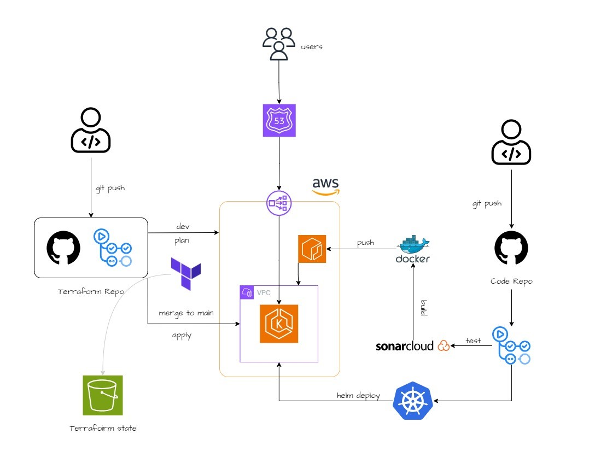

# CI/CD and GitOps - Terraform, GitHub Actions and Kubernetes

## Project Hierarchy

- `/.github/workflows`: GitHub actions file
- `/terraform`: Terraform files

## Architecture Overview



## Prerequisites

- AWS CLI Setup
- Terraform CLI Setup
- GitHub Account

## How to test this project

### Clone the repository 

```
git clone https://github.com/YU88John/eks-ecr-gitops-tf.git
```

### Create S3 Bucket for Terraform State

The GitHub Actions will be triggered based on the `push` events to `/terraform` directory.

We need terraform state to keep track of the state of actual infrastructure. If we don't have a state file, a whole new infrastructure will be created every time the `push` event occurs. <a href="https://developer.hashicorp.com/terraform/language/state">Read more about this</a>.

For this project, we will create an S3 bucket to store that terraform state file. You can create via cli:

```
aws s3 mb --region us-east-1 s3://<your_unique_name>
```

### Setup Secrets 

To apply terraform from GitHub Actions, it needs permissions on AWS resources. Moreoever, the bucket name will also be fetched as a Secret. Create GitHub Secrets with the following keys and your respective values. 

- <a href="https://docs.aws.amazon.com/IAM/latest/UserGuide/id_credentials_access-keys.html">How to Create Access Keys</a>
- <a href="https://docs.github.com/en/actions/security-guides/using-secrets-in-github-actions">How to add Secrets in GitHub Actions</a>

```
AWS_ACCESS_KEY_ID

AWS_SECRET_ACCESS_KEY

BUCKET_TF_STATE
```

### Replace your values

You need to replace your values in `/terraform/terraform.tf`. The snippet is as below:

```
backend "s3" {
    bucket = ""
    key    = "terraform.tfstate"
    region = "us-east-1"
  }
```